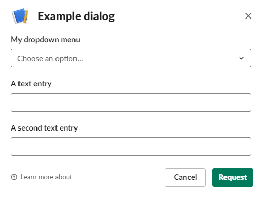

# Google Cloud Functions for Slack apps

Cloud Functions for 
* Slack - Slash commands (https://api.slack.com/slash-commands)
* Slack - Dialogs (https://api.slack.com/dialogs)

Google has a [guide](https://cloud.google.com/functions/docs/tutorials/slack) to Slack apps, but it is outdated and using [Legacy tokens](https://api.slack.com/custom-integrations/legacy-tokens) from Slack.  
These Cloud Functions implement the newer and safer way for Slack apps to verify that the request comes from Slack: https://api.slack.com/docs/verifying-requests-from-slack

## Flow
The Slack app should be configured to send a Slash command to the Google Cloud function under directory `slash_command`:  
  

The Google Cloud function `slash_command` sends a short message to the user, and triggers a Slack dialog window:  
  

Once the user responds to the dialog, Slack sends a handled by the Cloud function under directory `dialog_submission`, which pushes the message containing the submission data and other data sent by Slack to into a topic on Google Cloud Pub/Sub. 

## Setup
Prequisite: You must have a Cloud Pub/Sub topic. You will also need to give the user running the Dialog Cloud Function write access to that topic.

Deploy the Cloud Functions:

Configure environment variables for the configurable options.
```
export slash_command=</YOUR-SLASH-COMMAND>
export pubsub_topic=projects/<YOUR-PROJECT>/topics/<YOUR-TOPIC>
export signing_secret=<YOUR_SIGNING_SECRET_FROM_SLACK>
export oauth_token=<YOUR_APPS_SLACK_OAUTH_ACCESS_TOKEN>
```

Slash command function:
```
cd src/slash_command
gcloud functions deploy slash_command --runtime python37 --trigger-http --memory=128MB --set-env-vars SLACK_SIGNING_SECRET=$signing_secret,SLACK_OAUTH_TOKEN=$oauth_token,SLACK_SLASH_COMMAND=$slash_command
```

Dialog handling function:
```
cd src/dialog_submission
gcloud functions deploy dialog_submission --runtime python37 --trigger-http --memory=128MB --set-env-vars PUBSUB_TOPIC_NAME=$pubsub_topic,SLACK_SIGNING_SECRET=$signing_secret
```
